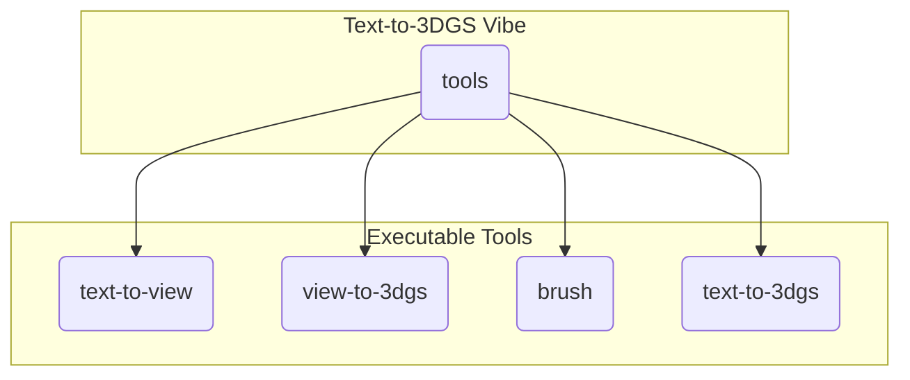

# Text-to-3DGS Vibe

> An experimental toolkit to generate 3D Gaussian Splatting scenes from text prompts, powered by Rust and WGPU.

[](https://www.rust-lang.org/)
[](https://wgpu.rs/)
[](https://repo-sam.inria.fr/fungraph/3d-gaussian-splatting/)

## Overview

**Text-to-3DGS Vibe** is a project aimed at creating a complete pipeline for generating and rendering 3D Gaussian Splatting (3DGS) scenes from simple text descriptions. It leverages the Google Veo API for video generation and a custom Rust-based toolchain for processing and rendering.

## Project Structure

The repository is organized into a collection of executable applications in the `tools` directory.



-   **`tools/`**: Contains standalone applications that perform specific tasks in the Text-to-3DGS pipeline.

## Getting Started

1.  **Update Rust**: Ensure you have the latest stable version of Rust.
    ```shell
    rustup update stable
    ```

2.  **Clone Repository**: Clone the repository with its submodules.
    ```shell
    git clone --recursive https://github.com/AsherJingkongChen/text-to-3dgs-vibe.git
    cd text-to-3dgs-vibe
    ```

3.  **Set Up API Key**: The `text-to-view` tool requires a Google Gemini API key.
    ```shell
    export GEMINI_API_KEY="YOUR_GEMINI_API_KEY"
    ```

4.  **Build the Project**: Build all tools and libraries.
    ```shell
    cargo build
    ```

## The Toolbox

Here is a guide to the applications available in the `tools/` directory.

---

### 1. `text-to-view`

This tool is the first step in the pipeline. It takes a text prompt, calls the Google Veo API to generate a short video, and extracts keyframes from it.

**Usage:**

```shell
# Use a prompt that implies camera movement for more dynamic views
cargo run -p text-to-view -- "a drone flying around a majestic panda meditating on a mountain"
```

This command will create a `views/` directory containing the extracted frames (`0.jpg`, `1.jpg`, etc.).

---

### 2. `view-to-3dgs`

This tool is a Python-based server that reconstructs a 3D Gaussian Splatting scene from a set of input images. It is the second step in the pipeline, taking the frames generated by `text-to-view` and producing a `.ply` file.

**Setup and Usage:**

This tool runs as a local server. Before using it, you must complete a one-time setup.

1.  **Navigate to the tool's directory:**
    ```shell
    cd tools/view-to-3dgs
    ```

2.  **Run the local deployment script:**
    This script will install all necessary Python dependencies using `uv` and download the required model checkpoints on a remote server from Vast AI.
    ```shell
    ./deploy_locally.sh
    ```

3.  **Access the server:**
    After the setup and SSH login, you can access the server by running:
    ```shell
    curl http://localhost:8888/
    ```

4. **Reconstruct a 3D scene:**
    You can send a POST request to the server with your images to reconstruct a 3D scene. For example:
    ```shell
    curl -X POST -F "images=@views/0.jpg" -F "images=@views/1.jpg" -F "images=@views/2.jpg" http://localhost:8888/reconstruction -o output.ply
    ```

The server will now be listening on `localhost:8888`. The `text-to-3dgs` tool will automatically send requests to this server.

---

### 3. `brush`

A powerful, interactive viewer and trainer for 3DGS models, built on WebGPU. It can load `.ply` files for viewing or train new models from datasets.

**Example (Display):**

```shell
# Interactively display a generated model
cargo run -p brush_app -- --with-viewer output.ply
```

---

### 4. `text-to-3dgs`

The master tool that orchestrates the entire pipeline, from text prompt to final 3DGS model.

**Usage:**

```shell
# This will automate the full process
cargo run -p text-to-3dgs -- "a drone flying around a majestic panda meditating on a mountain"
```

## Contributing

Contributions are welcome! Please feel free to open an issue for discussion or submit a pull request.

## License

This project contains parts with different licenses. Please refer to the `LICENSE` file in each crate or tool for specific details.
